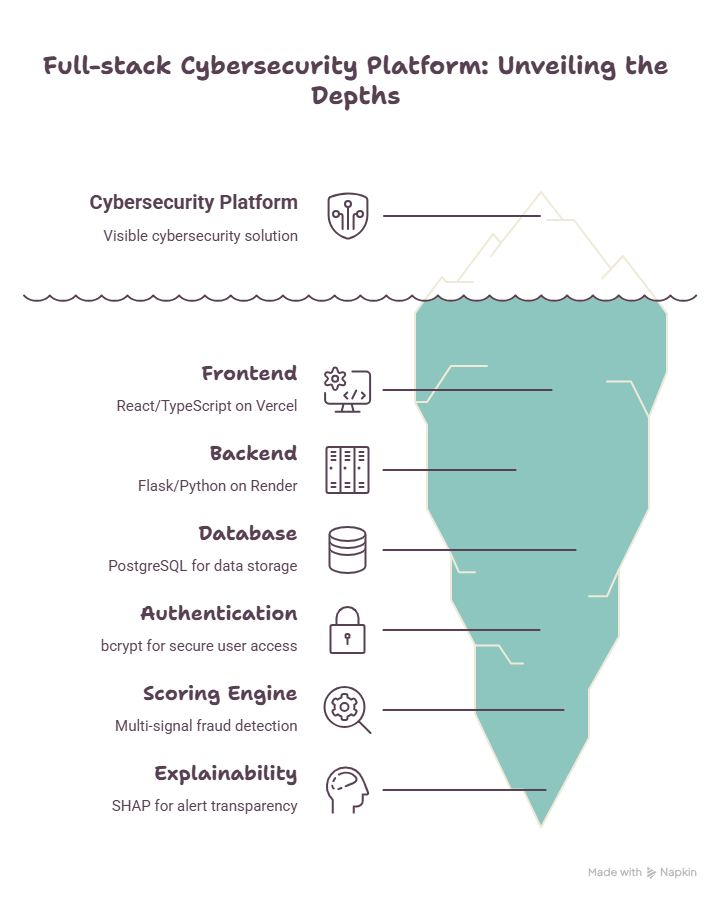
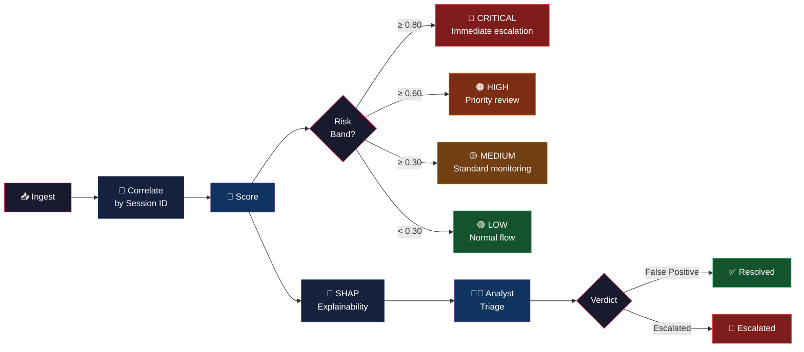
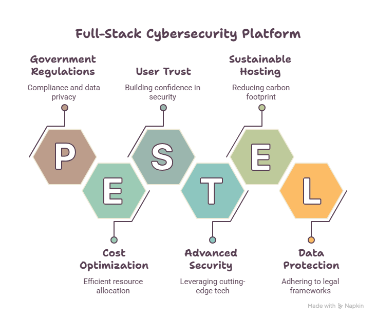

<div align="center">

# SENTINEL-Q

### AI-Driven Correlation of Cybersecurity Telemetry & Transactional Behaviour

**FinSpark'26 · Problem Statement 2**

[](https://python.org)
[](https://flask.palletsprojects.com)
[](https://react.dev)
[](https://typescriptlang.org)
[](https://postgresql.org)
[](https://tailwindcss.com)

[](LICENSE)
[](https://github.com/hulamanisrinish-cpu/SENTINEL-Q-Fraud-Detection-Security-Intelligence-Platform/pulls)

---

**Banks run fraud detection and cybersecurity monitoring as separate systems.**  
A session with both a suspicious login *and* an unusual transaction — the actual signature of account-takeover fraud — gets scored twice, weakly, by two systems that never talk to each other.

**SENTINEL-Q changes that.**

[🔗 **Live Demo**](https://sentinel-q-puce.vercel.app) · [📖 **API Docs**](https://sentinel-q.onrender.com/health)

---

</div>

## The Problem

Financial institutions face a critical blind spot: fraud detection and cybersecurity monitoring operate in silos. The most dangerous attacks — account takeover, session hijacking, coordinated fraud — sit at the intersection of *both* domains. Neither system alone can catch them.

Additionally, most institutions have zero visibility into which internal services still rely on classical (non-quantum-safe) cryptography for data with long confidentiality lifetimes.

## The Solution

SENTINEL-Q is a **real-time correlation engine** that joins transaction behavior and security telemetry on session/customer ID, producing a single **explainable composite risk score** — and separately flags **cryptographic posture exposure** — all surfaced through a professional SOC-analyst dashboard.

<div align="center">



</div>

---

## Key Features

<table>
<tr>
<td width="50%">

### Correlation Engine
Joins transaction and telemetry data on session ID to detect threats that neither system catches alone.

### Multi-Dimensional Scoring
- **Fraud Score** — amount z-score, velocity patterns, new payee detection
- **Telemetry Score** — IP reputation, geo mismatch, device fingerprint changes, failed auth
- **Quantum Posture Score** — cipher suite risk × data sensitivity classification

</td>
<td width="50%">

### Explainable AI (SHAP)
Every alert includes per-feature attribution so analysts understand *why* a session was flagged — not just *that* it was.

### Live Configuration
Adjust scoring weights and risk thresholds in real-time without redeployment.

### Crypto Posture Monitoring
Flags services using quantum-vulnerable cryptography (RSA, 3DES, CBC-mode ciphers) for data with long-term confidentiality needs.

</td>
</tr>
</table>

---

## Tech Stack

| Layer | Technology | Purpose |
|-------|-----------|---------|
| **Frontend** | React 18, TypeScript, Tailwind CSS, Vite | SOC analyst dashboard |
| **3D / Motion** | Three.js, Framer Motion, Recharts | Immersive UI, data visualization |
| **Backend** | Python 3.14, Flask, Gunicorn | REST API, session management |
| **Database** | PostgreSQL (prod) / SQLite (dev) | Persistent storage |
| **Security** | bcrypt, Flask-Limiter, Flask-CORS | Auth, rate limiting, CORS |
| **Deployment** | Render (backend) + Vercel (frontend) | Cloud hosting |

---

## Getting Started

### Prerequisites

- **Python 3.11+**
- **Node.js 18+**
- **pip** & **npm**

### 1. Clone the Repository

```bash
git clone https://github.com/hulamanisrinish-cpu/SENTINEL-Q-Fraud-Detection-Security-Intelligence-Platform.git
cd SENTINEL-Q-Fraud-Detection-Security-Intelligence-Platform
```

### 2. Backend Setup

```bash
# Install dependencies
pip install -r backend/requirements.txt

# Start the Flask server
cd backend
python app.py
```

Backend runs at `http://127.0.0.1:5000`

### 3. Frontend Setup

```bash
cd frontend

# Install dependencies
npm install

# Start dev server
npm run dev
```

Frontend runs at `http://localhost:3000`

### 4. Seed Sample Data (Optional)

```bash
python generate_data.py
```

This populates the database with 200 realistic sessions (including 30 high-risk scenarios).

---

## Project Structure

```
sentinel-q/
├── scoring_engine.py          # Risk scoring engine (fraud + telemetry + quantum)
├── init_db.py                 # Database schema creation & seeding
├── generate_data.py           # Sample data generator
├── db_compat.py               # PostgreSQL / SQLite compatibility layer
├── backend/
│   ├── app.py                 # Flask API (15+ endpoints)
│   ├── requirements.txt       # Python dependencies
│   └── gunicorn.conf.py       # Production server config
├── frontend/
│   ├── src/
│   │   ├── components/
│   │   │   ├── AlertQueue.tsx      # Real-time alert feed
│   │   │   ├── AlertDetail.tsx     # Alert analysis + verdict
│   │   │   ├── LiveInput.tsx       # Live data ingestion
│   │   │   ├── CryptoPosture.tsx   # Quantum posture monitor
│   │   │   ├── ConfigPanel.tsx     # Scoring weight editor
│   │   │   ├── CoverPage.tsx       # Landing hero
│   │   │   ├── LoginPage.tsx       # Auth portal
│   │   │   └── ThreeBackground.tsx # 3D background
│   │   ├── api.ts             # API client with auth
│   │   └── App.tsx            # Main app shell
│   └── vercel.json            # SPA routing config
├── render.yaml                # Render deployment blueprint
└── sentinel_q.db              # SQLite database (local dev)
```

---

## API Reference

| Method | Endpoint | Description |
|--------|----------|-------------|
| `GET` | `/api/alerts` | List alerts (filter: `?risk_band=HIGH&limit=50`) |
| `GET` | `/api/alerts/{id}` | Alert detail with transaction, telemetry, SHAP |
| `POST` | `/api/alerts/{id}/verdict` | Submit analyst verdict |
| `GET` | `/api/crypto-posture/summary` | Quantum-vulnerable cipher report |
| `GET` | `/api/config` | Current scoring weights |
| `PUT` | `/api/config` | Update weights & thresholds |
| `GET` | `/api/stats` | System statistics |
| `POST` | `/api/simulate` | Simulate a transaction (demo) |
| `POST` | `/api/ingest` | Ingest raw transaction + telemetry |
| `POST` | `/api/auth/login` | Analyst login |
| `POST` | `/api/auth/register` | Create analyst account |
| `GET` | `/api/auth/me` | Current session info |

---

## How It Works

<div align="center">



</div>

### Scoring Formula

<div align="center">

```
Composite Score = (0.40 × Fraud) + (0.40 × Telemetry) + (0.20 × Quantum Posture)

    ┌─────────────┐    ┌──────────────┐    ┌────────────────┐
    │ Fraud Score │    │  Telemetry   │    │ Quantum Posture│
    │             │    │    Score     │    │     Score      │
    │ • Amount    │    │ • IP Rep     │    │ • Cipher Risk  │
    │ • Velocity  │    │ • Geo Match  │    │ • Sensitivity  │
    │ • New Payee │    │ • Device FP  │    │   Multiplier   │
    │ • Auth Fail │    │ • Auth Count │    │                │
    └─────────────┘    └──────────────┘    └────────────────┘
```

</div>

---

## Architecture

<div align="center">



</div>

---

## Deployment

The app is deployed as two services:

| Service | Platform | URL |
|---------|----------|-----|
| Backend API | Render | [sentinel-q.onrender.com](https://sentinel-q.onrender.com) |
| Frontend | Vercel | [sentinel-q-puce.vercel.app](https://sentinel-q-puce.vercel.app) |

### Deploy Your Own

**Backend (Render):**
1. Fork this repo
2. Create a new Render Web Service
3. Render will auto-detect `render.yaml` and configure everything

**Frontend (Vercel):**
1. Import the repo on [vercel.com](https://vercel.com)
2. Set root directory to `frontend`
3. Add env variable: `VITE_API_URL` = `https://your-backend.onrender.com`
4. Deploy

---

## Contributing

Contributions are welcome! Please open an issue or submit a pull request.

1. Fork the repo
2. Create a feature branch (`git checkout -b feature/amazing`)
3. Commit changes (`git commit -m 'Add amazing feature'`)
4. Push to branch (`git push origin feature/amazing`)
5. Open a Pull Request

---

## License

This project is licensed under the MIT License — see the [LICENSE](LICENSE) file for details.

---

<div align="center">

**Built for FinSpark'26**

*Combining fraud detection and cybersecurity telemetry into a single, explainable risk signal.*

</div>
